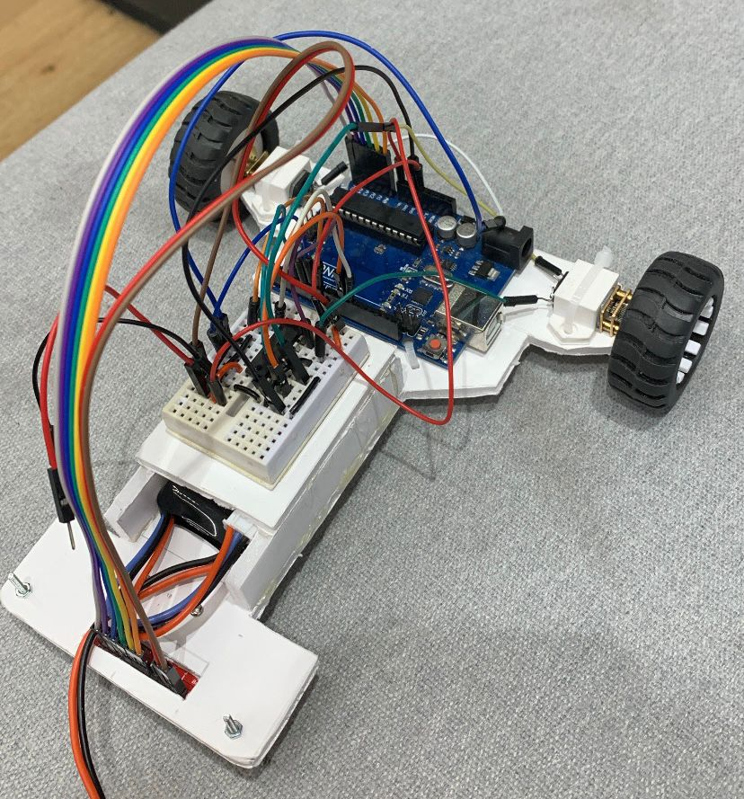
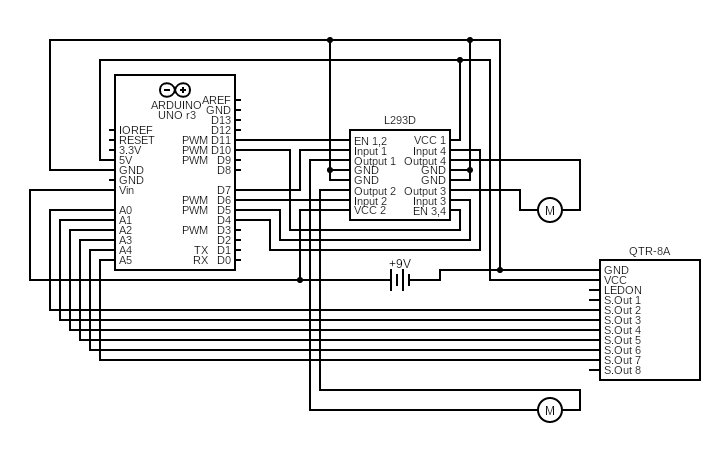

# IntroductionToRobotics
    Introduction to Robotics Homework Repository

## About
This is my personal GitHub repository, a dedicated space for all the engaging laboratory homework assignments I've tackled during my third year at the Faculty of Mathematics and Computer Science, University of Bucharest. Here, you'll find a collection of captivating robotics challenges that have enriched my understanding of this dynamic field.

## What's Inside?
For each homework assignment I've compiled the clear task requirements and/or description, implementation details, a photo of my hardware setup and a link to a video showcasing functionality. This has been a voyage of discovery, where I've combined theoretical insights with hands-on coding and experimentation. 

## Key Features

- **Theory and Practice**: Approaching each assignment with utmost professionalism has helped me deepen my theoretical knowledge and sharpen my practical skills.

- **Code and Images**: Well explained code and visual exemplification are paramount to one's better understanding of the task at hand.

# Homework

## Homework #1 - RGB

 
This assignment focuses on controlling each channel (Red, Green, and Blue) of  an  RGB  LED  using  individual  potentiometers.

[Assignment folder](https://github.com/MariusAlexandru358/IntroductionToRobotics/tree/main/LedRGB)

### Components:
- Arduino UNO
- Breadbord
- RGB LED (1)
- Potentiometers (3)
- 330&#x2126; Resistors (3)
- Wires as needed

### Technical Task
Use a separate potentiometer for controlling each color of the RGB LED: Red, Green and Blue. The control must leverage digital electronics.

### Breakdown
This is a straightforward task. All we have to do is read the values from the potentiometers (these are analog values), map them to the 0-255 interval, and write the resulting value to the LED pin. Of course, each potentiometer corresponds to one color of the RGB LED.

### Electrical Schematic

### Hardware Setup

### Video showcasing functionality
<a href="https://youtu.be/jgkgB0jxtuw" target="_blank">youtube link here</a>

---

## Homework #2 - Elevator Simulator

 
This assignment involves simulating a 3-floor elevator control system using LEDs, buttons, and a buzzer with Arduino.

[Assignment folder](https://github.com/MariusAlexandru358/IntroductionToRobotics/tree/main/ElevatorSim)

### Components:
- Arduino UNO
- Breadbord
- Pushbuttons (At least 3 for floor calls)
- LEDs (At least 4: 3 for the floors and 1 for the elevator's operational state)
- 330&#x2126; or 220&#x2126; Resistors (4)
- Buzzer (1)
- 100&#x2126; Resistor (1)
- Wires as needed

### Technical Task
Design a control system that simulates a 3-floor elevator using the Arduino platform. Specific requirements:
- **LED Indicators:** Each of the 3 LEDs should represent one of the 3 floors. The LED corresponding to the current floor should light up.  Additionally, another LED should represent the elevator’s operational state. It should blink when the elevator is moving and remain static when stationary.
- **Buttons:** Implement 3 buttons that represent the call buttons from the 3 floors.  When pressed, the elevator should simulate movement towards the floor after a short interval (2-3 seconds).
- **Buzzer:** The buzzer should sound briefly when the elevator arrives at the desire floor (something resembling a ”cling”), when the elevator doors are closing and during movement.
- **State Change & Timers:** If the elevator is already at the desired floor, pressing the button for that floor should have no effect. Otherwise, after a button press, the elevator should ”wait for the doors to close” and then ”move” to the corresponding floor. If the elevator is in movement it should either do nothing or it should stack its decision (get to the first programmed floor, open the doors, wait, close them and then go to the next desired floor).
- **Debounce:** Implement debounce for the buttons to avoid unintentional repeated button presses.

### Breakdown
One way to implement this is by using the function millis() to get the timestamp of when a button push is confirmed by the debounce logic and then with the help of the same function we can calculate how much time has passed since that event. Let's say it takes 3 seconds for the elevator to move up a floor, then after 3000 milliseconds we simulate moving up to that floor by turning on the corresponding LED. We can apply the same logic for all the actions we must implement. 

### Electrical Schematic

### Hardware Setup

### Video showcasing functionality
<a href="https://youtu.be/h7vUpx4tfUE" target="_blank">youtube link here</a>

---

## Homework #3 - 7 Segment Display Drawing

 
This assignment involves using the joystick in order to control the position of the segment and ”draw” on the display. The movement between segments should be natural, meaning they should jump from the current position only to neighbors, but without passing through ”walls”.

[Assignment folder](https://github.com/MariusAlexandru358/IntroductionToRobotics/tree/main/Drawing7SegmentDisplay)

### Components:
- Arduino UNO
- Breadbord
- 7-Segment-Display (1)
- Joystick (1)
- 330&#x2126; or 220&#x2126; Resistors (8)
- Wires as needed

### Technical Task
The initial position should be on the DP. The current position always blinks (irrespective of the fact that the segment is on or off). Use the joystick to move from one position to neighbors (see table for corresponding movement). Short pressing the button toggles the segment state from ON to OFF or from OFF to ON. Long pressing the button resets the entire display by turning all the segments OFF and moving the current position to the decimal point.

| Current segment | UP | DOWN | LEFT | RIGHT |
| --------------- | -- | ---- | ---- | ----- |
| **a**           |N/A |  g   |  f   |   b   |
| **b**           | a  |  g   |  f   |  N/A  | 
| **c**           | g  |  d   |  e   |  dp   |
| **d**           | g  | N/A  |  e   |   c   | 
| **e**           | g  |  d   | N/A  |   c   |
| **f**           | a  |  g   | N/A  |   b   | 
| **g**           | a  |  d   | N/A  |  N/A  |
| **dp**          |N/A |  N/A |  c   |  N/A  | 

### Breakdown
This assignment can be broken down into multiple simpler tasks. 
- **Input detection:** The push-button needs debouncing and to be able to also detect long pushes. For the movements on the joystick we will set thresholds it needs to pass in order to be registered.
- **Calculating the next position and moving to it**
- **Updating the blinking** of the selected LED
- **Toggling the state** of a LED or **reseting** the display and position

### Electrical Schematic

### Hardware Setup

### Video showcasing functionality
<a href="https://youtu.be/JfM9QyAPTl4" target="_blank">youtube link here</a>

---

## Homework #4 - Stopwatch Timer

 
Using the 4 digit 7 segment display and 3 buttons, implement a stopwatch timer that counts in 10ths of a second and has a save lap functionality (similar to most basic stopwatch functions on most phones).

[Assignment folder](https://github.com/MariusAlexandru358/IntroductionToRobotics/tree/main/StopwatchTimer)

### Components:
- Arduino UNO
- Breadbord
- SN74HC595N Shift Register (1)
- 4-Digit 7-Segment-Display (1)
- 330&#x2126; or 220&#x2126; Resistors (8)
- Pushbuttons (3)
- Wires as needed

### Technical Task
The starting value of the 4 digit 7-segment display should be "000.0". The buttons should have the following functionalities:
- Button 1: Start / Pause
- Button 2: Reset (if paused). Reset saved laps (if in lap viewing mode)
- Button 3: Save lap (if counting). Cycle through last saved laps (up to 4 laps)

Workflow:
1. Display shows "000.0" When pressing the **Start** button, the timer should start.
2. During the counting, each time you press the lap button, that value should be saved, up to 4 laps; pressing the 5th time should override the first saved one. Pressing the Reset button while counting should do nothing. Pressing the Pause button should stop the timer.
3. In **Pause** Mode, the Lap button shouldnt work anymore. Pressing the Reset button should reset the timer to "000.0".
4. After a reset, the Lap button should cycle through the saved lap times. Pressing it continuosly should cycle through the memory continously. Pressing the reset button while in this state should reset everything and set the timer back to "000.0".

### Breakdown
- In order to display the current time, we will cycle through the display digits and write the values for each digit to the shift register in serial mode, which will then send it to the 7-segment display. Because we can turn the LEDs on and off faster than your eyes can "see", we will creat the ilusion of a 4 digit number. Multiplexing logic is used to select which digit of the display we are writing on.
- The logic behind the buttons is relatively simple, it can be done with a few flags. Each button needs debouncing of course.
- In order to implement an extra functionality, I've decided to use a vector for the memory. The first position will always be a starting position ("000.0") from which we can start counting again, while the following positions are the memory spaces for the saved lap times. This way, we can start a timer, count one or more laps, see the data, and count again without losing the previous laps. For a practical use, we can increase the memory size (the vector size). Of course, the Reset button when pressed while in the lap viewing mode still works as intended.

### Electrical schematic

### Hardware Setup

### Video showcasing functionality
<a href="https://youtu.be/cyFr2RE60oo" target="_blank">youtube link here</a>

---

## Homework #5 - Pseudo-Smart Environment Monitor and Logger

 
The system utilizes various sensors to gather environmental data, logs this data into EEPROM, and provides both visual feedback via an RGB LED and user interaction through a Serial Menu. The project focuses on integrating sensor readings, memory management, Serial Communication and the general objective of building a menu.

[Assignment folder](https://github.com/MariusAlexandru358/IntroductionToRobotics/tree/main/PseudoSmartEnvironmentMonitorAndLogger)

### Components:
- Arduino UNO
- Breadbord
- (HC-SR04) Ultrasonic Sensor (1)
- Light-Dependent Rezistor / Photocell (1)
- RGB LED
- 330&#x2126; or 220&#x2126; Resistors (3)
- 330&#x2126; Resistor (1)
- Wires as needed

### Menu Structure
1. Sensor Settings
- Sensors Sampling Interval: prompt for a value between 1 and 10 seconds
- Ultrasonic Alert Threshold: prompt for a threshold value 
- LDR Alert Threshold: promt for a threshold value
- Back
2. Reset Logger Data: reset logged data
- Yes
- No
3. System Status:
- Current Sensor Readings: continuously print sensor readings
- Current Sensor Settings: display the sampling rate and threshold values
- Display Logged Data: display the last 10 sensor readings
- Back
4. RGB LED Control: 
- Manual Color Control: set the RGB colors manually
- LED: Toggle Automatic ON / OFF: toggle between the automatic mode (default colors) and custom mode (manually set colors)
- Back

### Breakdown
- Implement the menu and navigation
- Periodically read data from the sensors
- Set the RGB display to provide visual feedback
- Make sure all the extra menu options are implemented properly

### Electrical schematic

### Hardware Setup

### Video showcasing functionality
<a href="https://youtu.be/fbS9zhjPbgM" target="_blank">youtube link here</a>

---

## Homework #6 - Mini 8x8 LED Matrix Game

 
The purpose of this assignment is to create a basic game played on an 8x8 LED Matrix. 

[Assignment folder](https://github.com/MariusAlexandru358/IntroductionToRobotics/tree/main/Mini8x8LEDMatrixGame)

### Components:
- Arduino UNO
- Breadbord
- Joystick
- 8x8 LED Matrix
- MAX7219 (Matrix Driver)
- Resistor for the Matrix Driver (10k&#x2126; to 200k&#x2126;): I used 2 22k&#x2126; Resistors
- LED
- 330&#x2126; or 220&#x2126; Resistors (1)
- 1 electrolytic capacitor of 10 μF
- 1 ceramic capacitor of 104 pF
- Wires as needed

### Technical Task
The game must have at least 3 types of elements:
- Player (blinks slowly)
- Bombs or Bullets (blink fast)
- Walls (don't blink)
The basic idea is to generate walls on the map (50%-75% of the map) and then the player moves around and destroys them. The control must be smooth and walls should not be generated on top of the player.

### Breakdown
- Player movement: joystick input
- Wall generation: a function that uses the built-in function [random()](https://www.arduino.cc/reference/en/language/functions/random-numbers/random/) 
- Bombs: Button presses with different thresholds. Added a LED for visual confirmation.

### Electrical schematic

### Hardware Setup

### Video showcasing functionality
<a href="https://youtu.be/vjbd250-MIg" target="_blank">youtube link here</a>

---

## Homework #7 - 8x8 LED Matrix Game and LCD Menu (Checkpoint)

 
The purpose of this assignment is to make progress on the Matrix Project. (link and project not up yet, coming soon :D)
For now, I've used the mini game from the previous assignment as the gameplay.

[Assignment folder](https://github.com/MariusAlexandru358/IntroductionToRobotics/tree/main/8x8LEDMatrixGameAndLCDMenu)

### Components:
- Arduino UNO
- Breadbord
- Joystick
- 8x8 LED Matrix
- MAX7219 (Matrix Driver)
- Resistor for the Matrix Driver (10k&#x2126; to 200k&#x2126;): I used 2 22k&#x2126; Resistors
- LED
- 330&#x2126; or 220&#x2126; Resistors (1)
- 1 electrolytic capacitor of 10 μF
- 1 ceramic capacitor of 104 pF
- 16x2 LCD
- potentiometer
- 330&#x2126; or 220&#x2126; Resistors (1)
- Wires as needed

### Technical Task
After booting up, a greeting message should be shown for a few moments, before entering the main menu.

Menu Structure:
1. Play
2. Hihghscore (not required for this checkpoint)
3. Settings
- LCD Brightness 
- Matrix Brightness 
- Sound (not required for this checkpoint)
4. About
5. How to play (not required for this checkpoint)

During gameplay, relevant information must be displayed on the LCD.
After the game ends, an end message and the score should be displayed on the LCD, before returning to the main menu with user input.

### Breakdown
- The **Play** option leads to the game itself. The game starts and the input is now used to play the game instead of navigating through the menu options
- The **Settings** option leads to its submenu.
- The **LCD Brightness** option leads to a screen which allows the user to select between 10 levels of intensity. The prefered option is then applied and saved to EEPROM. 
- The **Matrix Brightness** option leads to a screen which allows the user to select between 10 levels of intensity. The prefered option is then applied and saved to EEPROM. 
- The **About** option displays the game name and creator (and also a the link to this github account :D)

While playing the game, the user can see how many remaining targets are there and how much time has passed since starting playing. The user's goal is to win as fast as possible (and show off his/her record to friends and family should it be among the best ever).
After the game ends, a *Congratulations!* message is displayed on the LCD, along with the time it took to win, before returning to the main menu with user input.

### Electrical schematic

### Hardware Setup

### Video showcasing functionality
<a href="https://youtu.be/jS-QKgulePE" target="_blank">youtube link here</a>

---

## Special Event - Line Follower

 
This project is part of the Introduction to Robotics course, undertaken during the third-year studies at the Faculty of Mathematics and Computer Science, University of Bucharest. It was fulfilled in a team of 3, La Furia Roja, alongside [@Mirela Ruka](https://github.com/Mirela89) and [@Alexia Maria Vasilache](https://github.com/alexia-maria).

A line follower robot is a device with the primary function of autonomously tracking a predefined path marked on the ground. 

It has a reflectance sensor underneath, acting as its' eyes, that constantly watches for a specific color or contrast, usually a dark line on a lighter surface. As the robot moves along, the sensor communicates with its brain, letting it know where the line is. If the sensor sees the line on the left, the robot adjusts to the left; if on the right, it adjusts to the right. This communication helps the robot make quick decisions to keep itself right on the path, using its wheels to make precise adjustments. 

### How it works
The line follower incorporates an automatic sensor calibration feature for precise navigation. The calibration process involves the robot moving left and right along its axis, responding to the sensor readings.

The motors' speed is dynamically controlled using a PID (Proportional-Integral-Derivative) control mechanism. After a lot of testing on the final track, optimal values for the PID constants were determined, with KP set at 8, KI at 0.0001, and KD at 2.

### Components

| Component  | Link |
| ------------- | ------------- |
| Arduino Uno  | https://docs.arduino.cc/hardware/uno-rev3|
| Half Size Breadboard  | https://www.kiwi-electronics.com/en/400pt-half-size-breadboard-white-283|
| LIPo battery | https://www.techtarget.com/whatis/definition/lithium-polymer-battery-LiPo|
| QTR-8A reflectance sensor  | https://www.pololu.com/product/960|
| L293D Motor Driver | https://www.instructables.com/How-to-use-the-L293D-Motor-Driver-Arduino-Tutorial/  |
| DC Motors(2) + Wheels(2) | https://www.tutorialspoint.com/arduino/arduino_dc_motor.htm |
| Other components | zip ties, jumper wires (M/M & F/M), ball caster, chassis |

### Setup
The chassis was designed and built by our team, using a material similar to carboard which can be found in any art shop. The board was cut as to fit all the components on it. We also built a small "pocket" for the battery, in order to insert/remove it easily.

  

### Electrical Schematic

  

### Functionality
For the grading we had 3 tries, meaning the robot had to complete 3 consecutive laps on the final track. In order to get the maximum grade, the track had to be completed in less than 20 seconds. In the video linked below is displayed the first lap, where the robot completed the track in aprox. 17 seconds. On the second lap, the robot completed the track faster, scoring a time of aprox. 16 seconds.

[Watch the video](https://www.youtube.com/shorts/_sgrDiwM9yc) to see this functionality in action and then [our best lap](https://youtube.com/shorts/CuKk1tvIPh8).

### [Code](https://github.com/MariusAlexandru358/IntroductionToRobotics/blob/main/LineFollower/lineF.ino)

---

